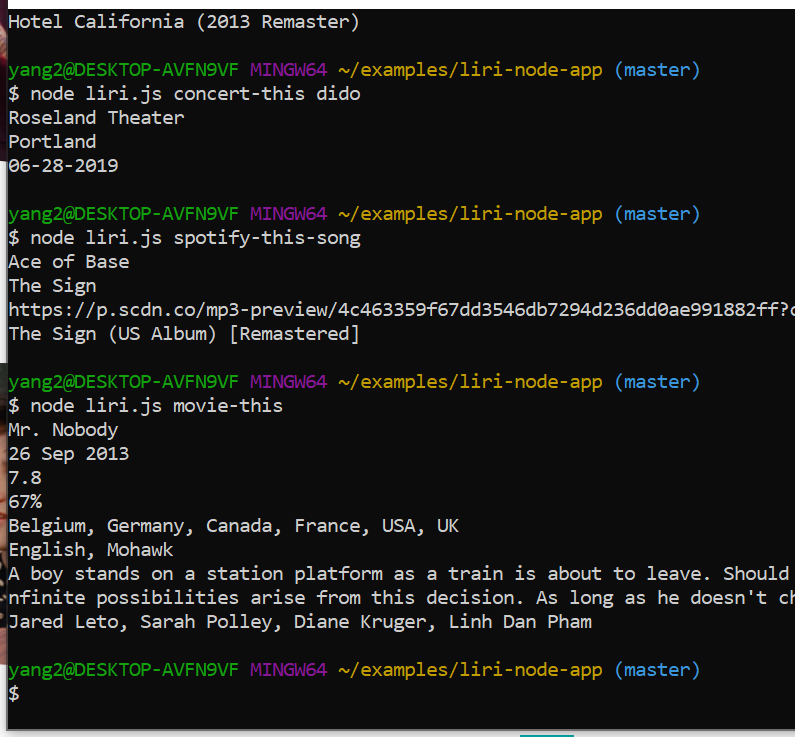
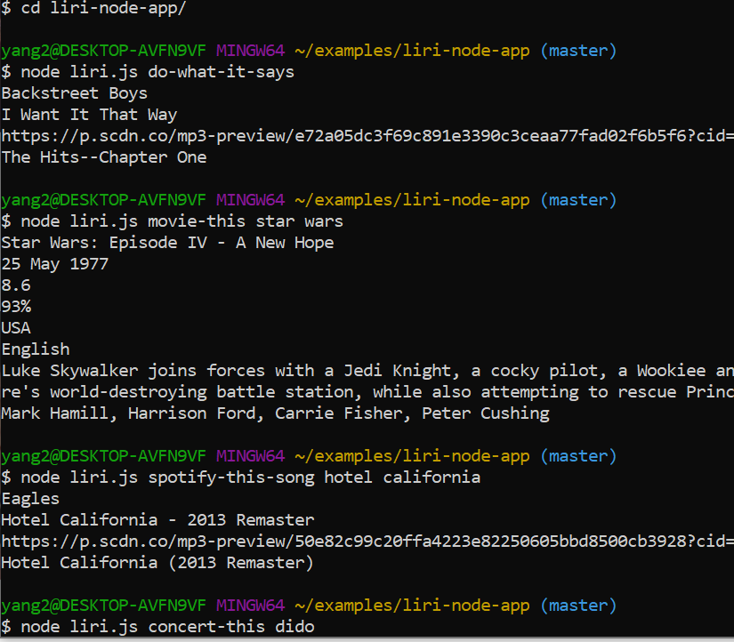

# liri-node-app
* This is a node.js App.  It can not be deployed to a web page.
* This App is for search concerts, songs, movies by a command line  interface.
* If you want to try this App, you should create a file named `.env`, add the following to it, replacing the values with your API keys (no quotes) once you have them from <https://developer.spotify.com/my-applications/#!/>

```js
# Spotify API keys

SPOTIFY_ID=your-spotify-id
SPOTIFY_SECRET=your-spotify-secret

```
* use `npm install` in commamd line .


## Try this App
* Search concerts use `node liri.js concert-this <artist/band name here>`
* Search songs use `node liri.js spotify-this-song '<song name here>'`
* Search movies use `node liri.js movie-this '<movie name here>'`
* Search by reading text content use `node liri.js do-what-it-says`.  There should be command above in the text.
* It shows like pictures below.


### Technologies
* This App use node.js and some npm APIs, like axios, dotenv, fs, moment, spotify.  You can find it from<https://www.npmjs.com/>
* use module exports to transfer object between .js files.

